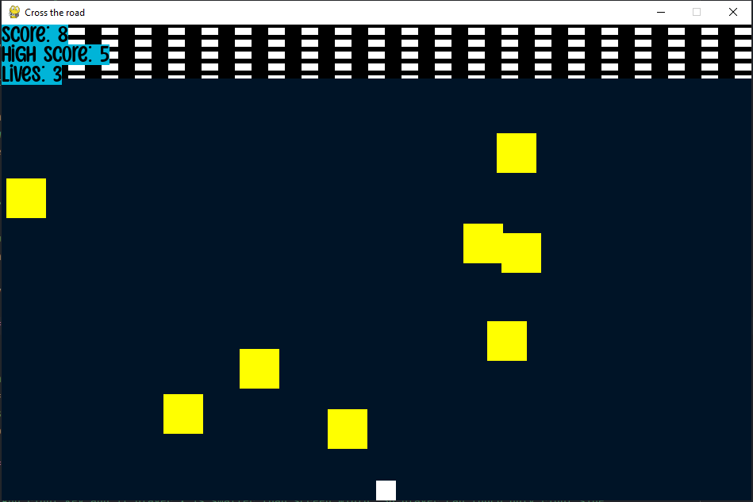
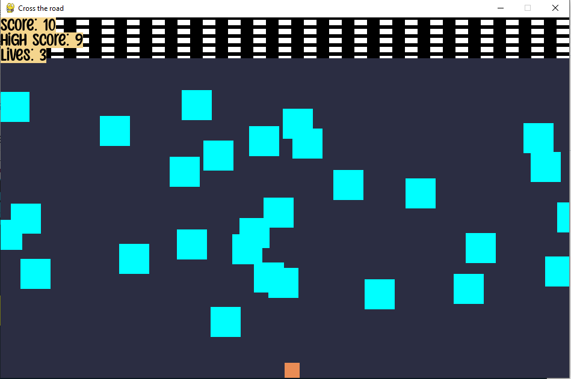

# cross-the-road-python
Created game in pygame on similar way to crossy road.
## Index
- [Screenshot](#screenshot)
- [Requirements](#requirements)
- [General](#general)
- [Game Features](#game-features)
- [Usage](#usage)
- [Resources](#resources)
- [Other](#other)

## Screenshot

## Requirements
* install
  ``
  pip install -r requirements.txt
  ``
## General
 * You're trying to get your player [**small square**] to the finish line, which is all the way up. 
 * Meanwhile, the enemy [big square] is coming from the right. Every time you touch the finish line, you get one more point. 
 * The game ends when you touch an enemy 3 times.
 
 ## Game Features 
 1. Achieving a score of 6
  - Chance to spawn enemy is **greater**
  - Enemy speed **increases**
 2. Achieving a score of 10 
  - You **can't use** <kbd>a</kbd> and <kbd>d</kbd>
 
 ## Usage 
 
| MOVE | MAIN BUTTON | SECOND BUTTON |
| :---         |     :---:      |          :---:    |
| **up**       |<kbd>w</kbd>    |<kbd>&uarr;</kbd> |
| **left**     |<kbd>a</kbd>   |<kbd>&larr;</kbd>  |
| **down**     |<kbd>s</kbd>   |<kbd>&darr;</kbd>  |
| **right**    |<kbd>d</kbd>   |<kbd>&rarr;</kbd>  |

 ## Resources
 1. Background music
  - I used [Chrome Music Lab](https://musiclab.chromeexperiments.com/Song-Maker/)
 2. Sounds
  - I used [Leshy SFMaker](https://www.leshylabs.com/apps/sfMaker/)
 3. Fonts
  - I used [Font Space](https://www.fontspace.com/commercial-fonts)

## Other
* If you find any issue, please don't hestitate to report it via [Issues](https://github.com/Fearplay/cross-the-road-python/issues)
* If you have idea to improve this game, please don't hestitate to create pull request via [Pull requests](https://github.com/Fearplay/cross-the-road-python/pulls)
* Thanks to all :green_heart:

[Back to TOP](#cross-the-road-python)
